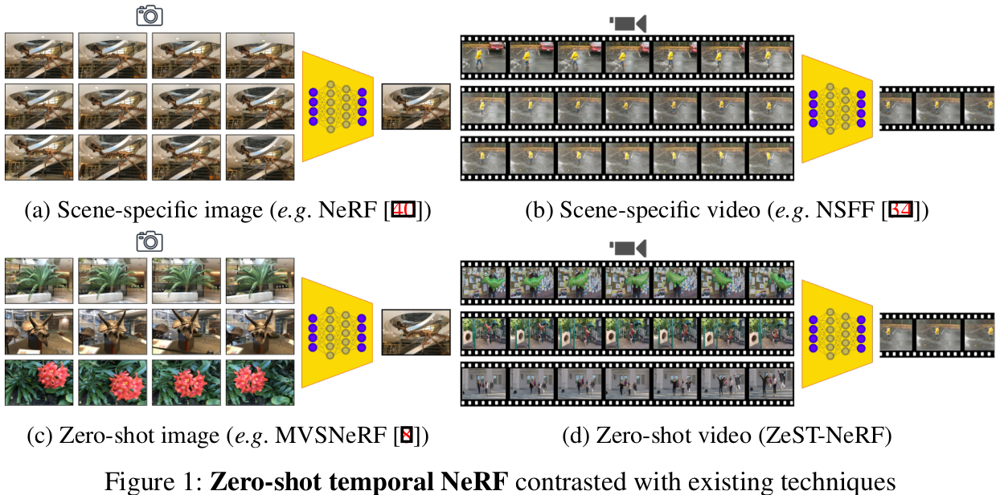
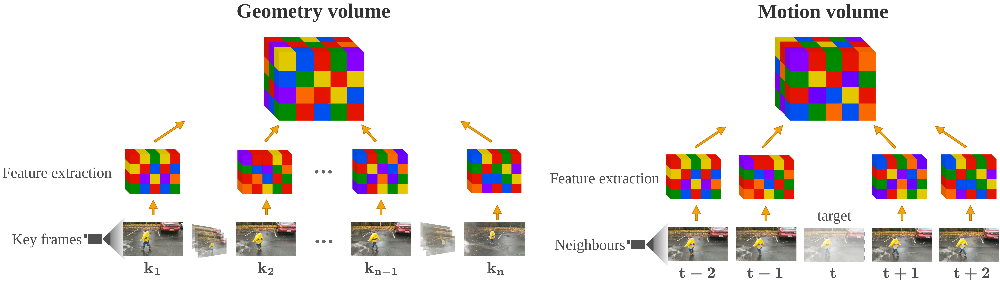
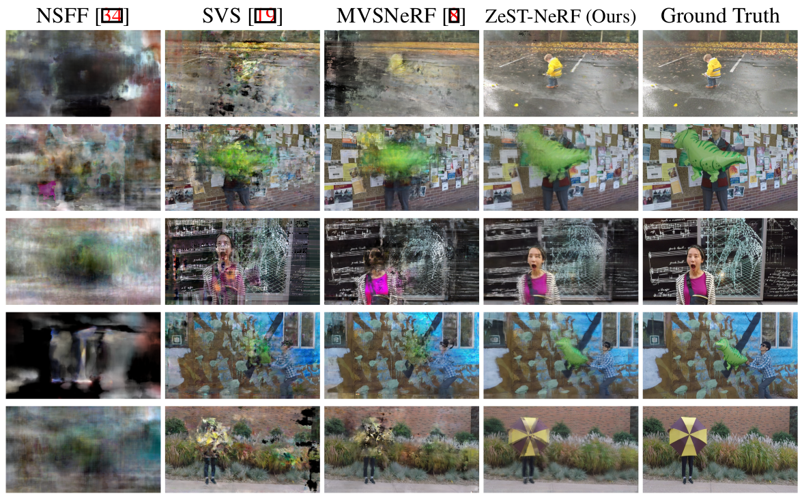

# ZeST-NeRF: Using temporal aggregation for Zero-Shot Temporal NeRFs
PyTorch Lightning implementation of paper "ZeST-NeRF: Using temporal aggregation for Zero-Shot Temporal NeRFs", published at VUA BMVC 2023. Research carried at the Centre for Vision Speech and Signal Processing at the University of Surrey, and BBC Research and Development.

> ZeST-NeRF: Using temporal aggregation for Zero-Shot Temporal NeRFs
> [Violeta Menéndez González](https://github.com/violetamenendez), [Andrew Gilbert](https://www.andrewjohngilbert.co.uk/), [Graeme Phillipson](https://www.bbc.co.uk/rd/people/graeme-phillipson), [Stephen Jolly](https://www.bbc.co.uk/rd/people/s-jolly), [Simon Hadfield](http://personal.ee.surrey.ac.uk/Personal/S.Hadfield/biography.html)  
> BMVC 2023
>

#### [Paper](https://arxiv.org/abs/2311.18491)



## Installation

#### Tested on Ubuntu 20.04 + Python 3.8 + Pytorch 1.10.1 + Pytorch Lightning 1.5.8

```
conda env create -f environment.yml
```

Alternatively, you can install the conda environment manually:
```
conda create -n svs python=3.8 pip
conda activate svs
conda install pytorch==1.12.1 torchvision==0.13.1 torchaudio==0.12.1 cudatoolkit=11.3 -c pytorch
python -m pip install pytorch-lightning==1.5.8
conda install pillow scipy
python -m pip install inplace_abn kornia
python -m pip install configargparse imageio opencv-python lpips coloredlogs
```

## Datasets

We use the Dynamic Scene Dataset from [Neural Scene Flow Fields](https://github.com/zhengqili/Neural-Scene-Flow-Fields) for training and testing performing a leave-one-out cross-validation study. For instructions on how to download the data and pre-process your own videos, follow their instructions on their repository.


## Training

You can train your own model using the following command with your own parameters:
```
python train.py --config <path_to>/configs/config_files/config_zest_nsff_cross<N>.txt
```

You can override any parameter as necessary when calling the script, for example
```
python train.py --config <config_file> --num_epochs 10 --num_keyframes 10
```
And turn on and off the static and dynamic encoding volumes switching `use_mvs` and `use_mvs_dy`.



## Testing
```
python test.py --config <config_file>
```



## Citation
```
@inproceedings{menendez2023zestnerf,
  author    = {Menéndez González, Violeta and Gilbert, Andrew and Phillipson, Graeme and Jolly, Stephen and Hadfield, Simon},
  title     = {ZeST-NeRF: Using temporal aggregation for Zero-Shot Temporal NeRFs},
  booktitle = {VUA BMVC},
  year      = {2023}
}

```

## Relevant Works
[**Neural Scene Flow Fields for Space-Time View Synthesis of Dynamic Scenes (CVPR 2021)**](https://arxiv.org/abs/2011.13084)<br>
Zhengqi Li, Simon Niklaus, Noah Snavely, Oliver Wang

[**MVSNeRF: Fast Generalizable Radiance Field Reconstruction from Multi-View Stereo (ICCV 2021)**](https://arxiv.org/abs/2103.15595)<br>
Anpei Chen, Zexiang Xu, Fuqiang Zhao, Xiaoshuai Zhang, Fanbo Xiang, Jingyi Yu, Hao Su

[**SVS: Adversarial refinement for sparse novel view synthesis (BMVC 2022)**](https://arxiv.org/abs/2211.07301)<br>
Violeta Menéndez González, Andrew Gilbert, Graeme Phillipson, Stephen Jolly, Simon Hadfield

[**NeRF: Representing Scenes as Neural Radiance Fields for View Synthesis (ECCV 2020)**](http://www.matthewtancik.com/nerf)<br>
Ben Mildenhall, Pratul P. Srinivasan, Matthew Tancik, Jonathan T. Barron, Ravi Ramamoorthi, Ren Ng

